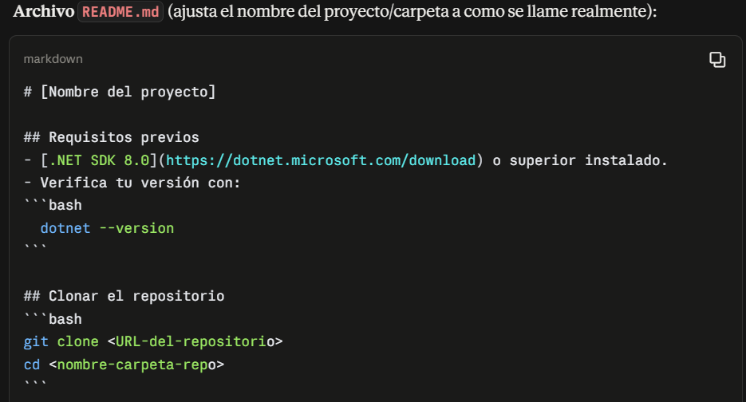
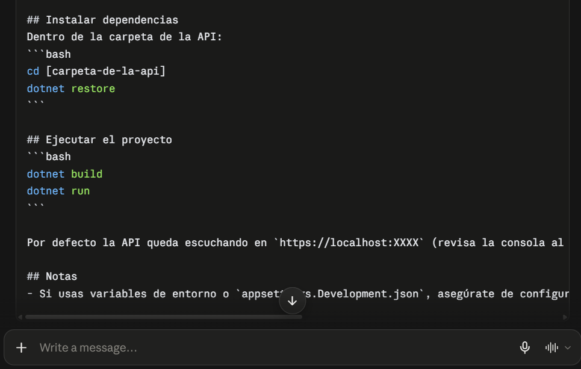

# Bitácora de sesión con el agente — Asignación 1

**Agente usado:** Claude (chat)
**Fecha:** 26 de septiembre de 2026
**Tarea delegada:** redactar el README de ejecución para el repositorio de mi pareja (`plataforma-planificacion-enfoque`), correspondiente al PR 2 de la sección 1.2.

---

## 1. Qué le pedí

Le pedí al agente que generara el contenido del `README.md` con las instrucciones para clonar, instalar dependencias y ejecutar el proyecto de mi pareja, que es una API en C#/.NET. Le indiqué que el proyecto se ejecuta con `dotnet build` y `dotnet run` desde la carpeta de la API. También le pedí la descripción del PR con las cuatro secciones (Qué cambia, Por qué, Cómo probarlo, Qué NO incluye).

## 2. Qué me devolvió

Un README con las secciones de requisitos previos, clonar el repositorio, instalar dependencias (`dotnet restore`), ejecutar (`dotnet build` y `dotnet run`) y notas. Además, la descripción del PR con las cuatro secciones.

## 3. Dónde se equivocó

**El error:** el README que me devolvió era una plantilla genérica de .NET, no las instrucciones reales del proyecto de mi pareja. No especificó cosas necesarias para correrlo de verdad:

- Dejó textos sin completar como `[Nombre del proyecto]` y `[carpeta-de-la-api]` en lugar de los valores reales del repositorio.
- Asumió una versión del SDK (.NET 8.0 o superior) sin haberme preguntado.
- No indicó desde qué carpeta exacta se corre `dotnet run` dentro de la estructura real del repositorio.
- No mencionó los puertos reales que usa la API ni dónde consultarlos.

**Cómo lo detecté:** antes de abrir el PR seguí el README paso a paso en mi máquina, tal como pide la asignación (el aporte debe estar verificado). Al hacerlo, me di cuenta de que no se podía seguir tal cual: había textos entre corchetes sin reemplazar y faltaban datos concretos del proyecto.

**Cómo lo corregí:** revisé el repositorio de mi pareja y reemplacé los textos genéricos por los datos reales. Volví a seguir el README completo desde una carpeta limpia y confirmé que la API levantaba sin pasos adicionales. Solo entonces abrí el PR.

## 4. Lección

El agente no tiene acceso al contenido real del repositorio, así que rellena con suposiciones lo que no sabe. Un README generado por IA solo se puede considerar correcto después de ejecutarlo uno mismo desde cero. Por eso la asignación exige verificarlo antes de abrir el PR.

## 5. Evidencias

